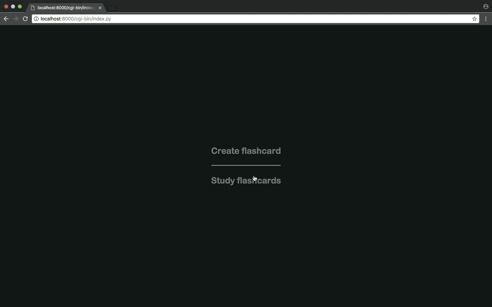

<h1 align="center">
  
</h1>

<h1 align="center">
   
  Ucards
   
</h1>

This is a web app which serves as a flashcards tool to learn new languages. It is highly customisable and really easy to use. Besides, portability comes in handy, as people will be able to share wordlists and learn from them.

### How it works

It consists of a python CGI script which will render the flashcards as html and save all the data in a sqlite3 file (hence we can transfer the file and get a wordlist in no time). Each flashcard will consist of a word and its translation, along with an image grabbed from the internet. The image will be obtained through a Google API, so if you want to use it you will need to get the cx code and a key from google developers console \*.

The python backend communicates with the javascript through AJAX POST and GET requests so almost all content is rendered dynamically.

### Images

The app basically consists of two control panels: the first one to create flashcards and the second to study and review these. The following GIFs show them respectively.

###### Create panel

###### Study panel

Don't hesitate to contribute and fork the project, I'll gladly accept contributions!

---

\* In case you need help on setting that up: https://stackoverflow.com/questions/6562125/getting-a-cx-id-for-custom-search-google-api-python
